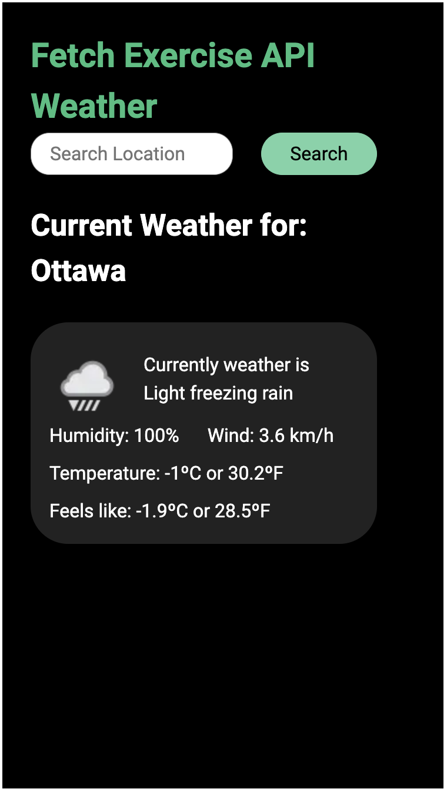
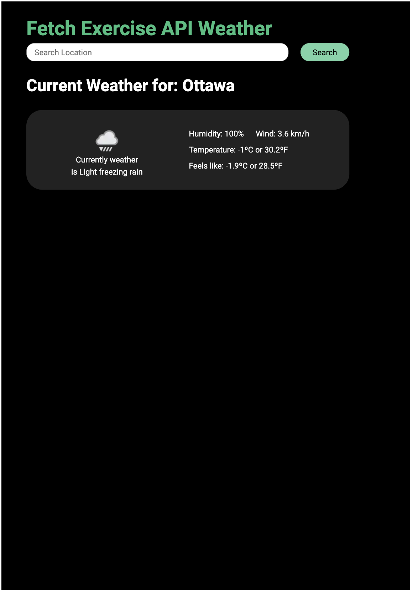

# Fetch API Weather App

#### A fetch Follow Along Exercise for PA Session

In this exercise, you'll learn how to use the Fetch API to retrieve weather information for a specific location using the .

[Weather API website](https://www.weatherapi.com/)

This is a simple web application that utilizes the WeatherAPI to fetch and display current weather information based on user input.

## Features

- **Search:** Enter a location and click the "Search" button to fetch the current weather data.
- **Dynamic Card:** The application dynamically generates a card displaying information such as temperature, humidity, and wind speed.

- iPhone Size Screen
  

- iPad Air Size Screen
  

### Prerequisites:

1. Sign Up for an Account:
   Visit the WeatherAPI provider's website (in your case, WeatherAPI).
   Look for a "Sign Up" or "Register" option and create an account.

2. Get Your API Key:
   Once you have an account, navigate to the developer or API section.
   Find the option to create a new API key or access your existing key.
   Copy the API key provided.

3. Understand Usage Limits:
   Check the usage limits associated with your API key. Free accounts often have limited usage, and exceeding these limits may result in restricted access.

4. Read Documentation:
   Familiarize yourself with the WeatherAPI documentation. This will provide details on the available endpoints, request parameters, and the structure of the API responses.

5. Include the API Key in Your Requests:
   In your JavaScript code where you make requests to the WeatherAPI, include your API key in the request URL. For example:

<pre>
const apiKey = 'YOUR_API_KEY';
const apiUrl = `https://api.weatherapi.com/v1/current.json?key=${apiKey}&q=your_location`;
</pre>

6. **Handle Errors**:

Implement error handling for cases where the API request fails. This can include network errors, invalid responses, or exceeded usage limits.

### Response code

<pre>
{
  "location":{
    "name":"London","region":"City of London, Greater London","country":"United Kingdom","lat":51.52,"lon":-0.11,"tz_id":"Europe/London","localtime_epoch":1699551229,"localtime":"2023-11-09 17:33"
  },
  "current":{
    "last_updated_epoch":1699551000,"last_updated":"2023-11-09 17:30","temp_c":8,"temp_f":46.4,"is_day":0,
    "condition":{
      "text":"Partly cloudy","icon":"//cdn.weatherapi.com/weather/64x64/night/116.png","code":1003
      },
    "wind_mph":12.5,"wind_kph":20.2,"wind_degree":250,"wind_dir":"WSW","pressure_mb":993,"pressure_in":29.32,"precip_mm":0.02,"precip_in":0,"humidity":81,"cloud":75,"feelslike_c":5,"feelslike_f":41.1,"vis_km":10,"vis_miles":6,"uv":1,"gust_mph":17.9,"gust_kph":28.7
  }
}
</pre>

### Dependencies

- Roboto Font: Used for the application's font.
- WeatherAPI: Provides current weather data.

### Usage

1. Enter a valid location in the input field.
2. Click the "Search" button.
3. View the dynamically generated weather card.

## Getting Started

1. Clone the repository:
   ```bash
   git clone https://github.com/sous0049/weather-app-sample
   ```
2. Open the index.html file in your web browser.
3. Enter a location in the input field and click the "Search" button.

## Creating your own

1. Create the HTML file following the best practices.
2. Link your CSS styling and JavaScript script to your HTML.
3. Create as Mobile First
   - Make sure your Search Box fits the screen
   - The user can easily select and type
   - Search button is big enough to click
   - The layout changes for bigger screens (Tablet and Desktop)
4. Apply best practices in your javascript
5. Name your variables and functions in a meaningful way
6. Make sure your javascript only runs when the page finished loading
7. Challenge yourself and make your code reusable
   - Meaning small functions to complete tasks
   - eg. fetchData, buildCard, errorHandler ...

## License

This project is licensed under the [MIT License](./LICENSE).
